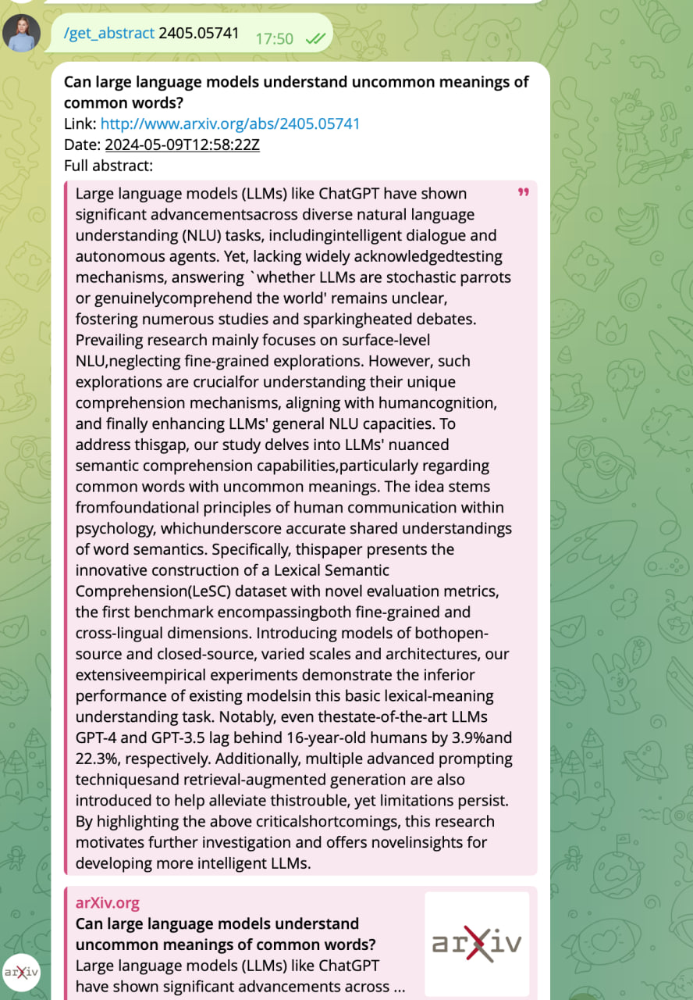

Super-simple tg bot that can scrape articles from arxiv by keywords.
It sends you n articles with keywords you specified presented in abstract.

To run:
1. get telegram token and fill in config.yaml
2.
```
poetry install
poetry run python src/main.py
```



